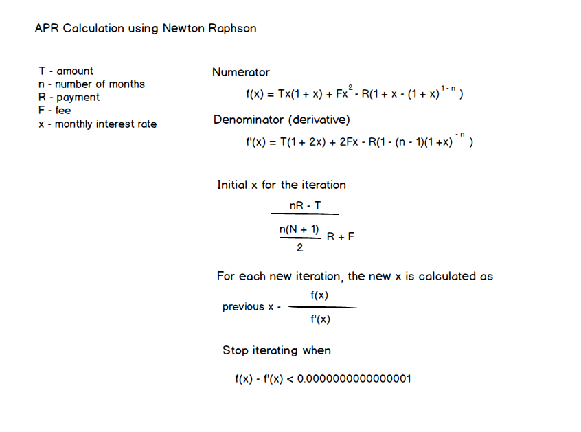

# Mortgage Lending Accelerator
This rule application demonstrates all of the basic strategies and patterns for supporting LOS integrations.  I contains the following capabilities.

* Entity model based on the latest URLA from Fannie Mae and Freddy Mac (to be live by November, 2020).
* Totals calculate across primary collections such as assets, liabilities, etc.
* Flow control based on the standard "Controller Pattern" that uses top-level rule sets to route execution to lower-level rule set.
* A monthly payment calculation.
* Monthly payment amortization.
* Loan limit enforcement for single unit properties based on Fannie Mae's guidelines.
* Transparent APR calculation.

* DTI enforcement for conforming loans.

## Predictions
The rule application now includes a ML service that predicts a home price based on several key data points.  It's intended to be an example and it's based on a Kaggle data set (training data is included in the repo).

Note that the service end-point for the ML service is hosted in Azure and may/may not be live.  

